# CMS-Handbuch für Redakteure

Ein Leitfaden für die Pflege der Website-Inhalte der RathausGalerien im Content-Management-System (CMS) Netlify.

## Inhaltsverzeichnis

1. [Einleitung](#1-einleitung)
2. [Login: Zugang zum CMS](#2-login-zugang-zum-cms)
3. [Überblick über die Oberfläche](#3-überblick-über-die-oberfläche)
4. [Content-Typen im Detail](#4-content-typen-im-detail)
   - [4.1 Pages (Seiten)](#41-pages-seiten)
   - [4.2 Funnels](#42-funnels)
   - [4.3 Categories (Kategorien)](#43-categories-kategorien)
   - [4.4 Services](#44-services)
   - [4.5 FAQs](#45-faqs)
   - [4.6 Locations (Shops & Gastronomie)](#46-locations-shops--gastronomie)
   - [4.7 Jobs (Stellenanzeigen)](#47-jobs-stellenanzeigen)
   - [4.8 News](#48-news)
   - [4.9 Gewinnspiele](#49-gewinnspiele)
   - [4.10 Blocks](#410-blocks)
   - [4.11 Farbschemas](#411-farbschemas)
   - [4.12 Einstellungen](#412-einstellungen)
5. [Bilder & Medien](#5-bilder--medien)
6. [Speichern & Veröffentlichen](#6-speichern--veröffentlichen)
7. [Wie lange dauert es, bis Änderungen live sind?](#7-wie-lange-dauert-es-bis-änderungen-live-sind)
8. [Häufige Fehler & Problembehebung](#8-häufige-fehler--problembehebung)
9. [Glossar](#9-glossar)
10. [Support & Ansprechpartner](#10-support--ansprechpartner)

---

## 1. Einleitung

Das CMS (Content-Management-System, sprich: "Inhalts-Verwaltungs-System") ist die Oberfläche, über die du Texte, Bilder und ganze Seiten der Website pflegst — **ohne Programmierkenntnisse**. Du meldest dich im Browser an, wählst links den gewünschten Inhaltstyp aus, bearbeitest ein Formular und klickst auf Speichern. Den Rest erledigt das System automatisch im Hintergrund.

Dieses Handbuch beschreibt **nur das, was in diesem Projekt tatsächlich eingerichtet ist**. Es gibt keine Vorschau-Funktion im CMS und keinen Entwurfs-Modus: Was du speicherst, geht direkt in die Warteschlange für die nächste Veröffentlichung (siehe Kapitel 6 und 7).

Oben links gibt es einen Link **Live ansehen** — dieser führt aus dem CMS heraus auf die Startseite der veröffentlichten Website, nicht auf eine Vorschau des gerade bearbeiteten Eintrags.

---

## 2. Login: Zugang zum CMS

Das CMS erreichst du über `https://www.rathausgalerien.at/admin/`.

Die Anmeldung läuft über **Netlify Identity** — ein Login-Fenster mit E-Mail-Adresse und Passwort, das sich beim Aufruf von `/admin/` automatisch öffnet.

> ⚠️ **Wichtig:** Es gibt keine öffentliche Registrierung. Neue Redakteure müssen von einem bestehenden Administrator per E-Mail eingeladen werden.

**So meldest du dich an:**

1. Rufe `/admin/` auf.
2. Trage deine E-Mail-Adresse und dein Passwort ein.
3. Klicke auf **Log in**.

**Passwort vergessen:**

1. Klicke im Login-Fenster auf **Forgot password?**
2. Gib deine E-Mail-Adresse ein und bestätige.
3. Du erhältst eine E-Mail mit einem Link zum Zurücksetzen des Passworts.
4. Folge dem Link und vergib ein neues Passwort.

**Erstmalige Einladung:**

1. Du erhältst eine E-Mail mit dem Betreff "You have been invited" (oder ähnlich).
2. Klicke auf den Link in der E-Mail.
3. Vergib dein persönliches Passwort.
4. Du landest direkt im CMS.

---

## 3. Überblick über die Oberfläche

Nach dem Login siehst du die Startansicht des CMS:

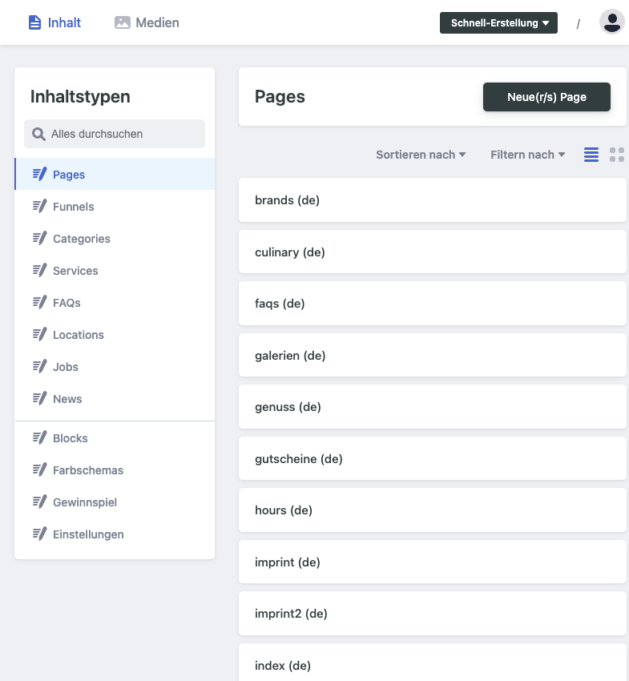

- **Oben links:** Reiter **Inhalt** (alle Inhaltstypen) und **Medien** (globale Bilder-Übersicht, siehe Kapitel 5).
- **Links (Seitenleiste):** Alle **Inhaltstypen** (in Decap "Collections" genannt) dieses Projekts:
  - Pages, Funnels, Categories, Services, FAQs, Locations, Jobs, News
  - darunter, optisch abgetrennt: Blocks, Farbschemas, **Gewinnspiel**, Einstellungen (das sind eher technische/globale Bausteine bzw. Aktionsseiten, siehe 4.9–4.12). Unter **Einstellungen** liegen zwei feste Einträge: **Farben** und **Gewinnspiel**.
- **Mitte:** Liste der vorhandenen Einträge des gewählten Inhaltstyps. Über **Sortieren nach** / **Filtern nach** lässt sich die Liste ordnen; über die Sprachfilter oben (bei mehrsprachigen Typen) nach Deutsch/Englisch filtern.
- **Neue(r/s) …-Button:** oben rechts, legt einen neuen Eintrag des gewählten Typs an.

Ein Klick auf einen Eintrag in der Liste öffnet dessen Bearbeitungsformular (siehe die jeweiligen Kapitel in Abschnitt 4).

> ℹ️ Es gibt **keine Live-Vorschau** innerhalb des CMS. Um ein Ergebnis zu sehen, musst du speichern und auf den nächsten automatischen Website-Build warten (Kapitel 7). Im geöffneten Formular zeigt der Link **Live ansehen** oben rechts die aktuell veröffentlichte (nicht die gerade bearbeitete) Version der Seite.

---

## 4. Content-Typen im Detail

Alle Inhaltstypen außer Farbschemas und Einstellungen sind **zweisprachig**: Jeder Eintrag hat ein Feld **Sprache** (Deutsch/Englisch) und muss für jede Sprache **einzeln** angelegt werden. Nutze die Filter "Deutsch"/"English" oben in der Listenansicht, um die Übersicht zu behalten.

Für alle Typen gilt außerdem das gleiche Grundmuster:

**Neuen Eintrag erstellen:**
1. Inhaltstyp links in der Seitenleiste wählen.
2. Oben rechts auf **Neue(r/s) …** klicken.
3. Formular ausfüllen (siehe Feldreferenz im jeweiligen Unterkapitel).
4. Speichern/Veröffentlichen (Kapitel 6).

**Bestehenden Eintrag bearbeiten:**
1. Inhaltstyp wählen, Eintrag in der Liste anklicken.
2. Felder anpassen.
3. Speichern/Veröffentlichen (Kapitel 6).

**Eintrag löschen:**
1. Eintrag öffnen.
2. Oben auf **Lösche Beitrag** klicken.
3. Löschen bestätigen.

> ⚠️ Löschen kann NICHT über das CMS rückgängig gemacht werden.

Die folgenden Unterkapitel beschreiben nur, was pro Typ **abweicht** oder **zusätzlich** zu beachten ist, sowie die Feldreferenz.

### 4.1 Pages (Seiten)

Alle "normalen" Unterseiten der Website: Startseite, Übersichtsseiten (Shops, Gastronomie, Services, FAQ, News, Jobs), Lageplan sowie einzelne Infoseiten (Impressum, Datenschutz, etc.).

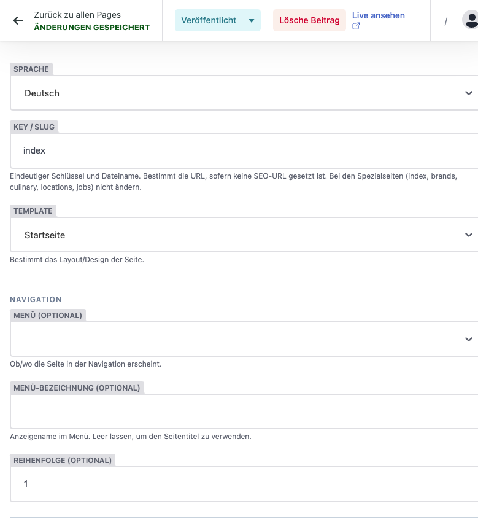

> ⚠️ Das Feld **Template** bestimmt das Layout/Design der Seite und schaltet unten weitere, nur für dieses Template relevante Felder frei (z. B. **Blocks** nur bei "Startseite", **Photos**/**Traffic information** nur bei "Lageplan", **Teaser** nur bei "Shops-/Gastronomie-Übersicht", **Message** nur bei "Jobs"). Welche Seite wie aussieht, entscheidet also das Template — **nicht** der Key.

> ⚠️ Zwei Ausnahmen beim **Key/Slug**, die nicht geändert werden dürfen:
> - `index` — das ist die Startseite (liegt unter `/` bzw. `/en/`).
> - `brands` und `culinary` — diese beiden Keys erzeugen fest die Adressen `/shops` und `/gastronomie`.
>
> Alle anderen Keys sind frei wählbar, solange das passende Template gesetzt ist (die Karriere-Seite heißt z. B. `karriere` und hat das Template "Jobs").

| Feld | Pflicht | Hinweis |
|---|---|---|
| Sprache | ja | Deutsch/Englisch |
| Key / Slug | ja | Nur Kleinbuchstaben, Zahlen, `-`. Bestimmt die URL, außer eine SEO-URL ist gesetzt. |
| Template | ja | Standardseite, Startseite, Shops-Übersicht, Gastronomie-Übersicht, Lageplan, Jobs, News-Übersicht, Services-Übersicht, FAQ-Übersicht. Bestimmt Layout & freigeschaltete Zusatzfelder (s. o.) |
| Menü | nein | Ob/wo die Seite im Menü erscheint (Hauptmenü/Footer/keines) |
| Menü-Bezeichnung | nein | Abweichender Anzeigename im Menü; leer = Seitentitel |
| Reihenfolge | nein | Zahl, Standard 1 |
| Heading | nein | Sichtbarer Titel (H1); dient auch als SEO-Titel, falls SEO-Titel leer |
| Intro | nein | Einleitungstext unter dem Titel |
| Content | nein | Freier Text (Markdown-Editor mit Formatierungsleiste) |
| Blocks | nein | Flexible Inhaltsblöcke, siehe unten |
| Teaser | nein | Nur Template "Shops-/Gastronomie-Übersicht", siehe unten |
| Photos | nein | Nur Template "Lageplan" |
| Traffic information | nein | Nur Template "Lageplan" |
| Message | nein | Nur Template "Jobs", Text bei keinen offenen Stellen |
| SEO → Title/Description/URL/Image/… | teils | Siehe Kapitel 5 für das Bild-Feld |

**Blocks im Detail:**

Blocks sind die flexiblen Inhaltsbausteine einer Seite. Du kannst beliebig viele davon untereinander anlegen; die Reihenfolge in der Liste ist die Reihenfolge auf der Seite.

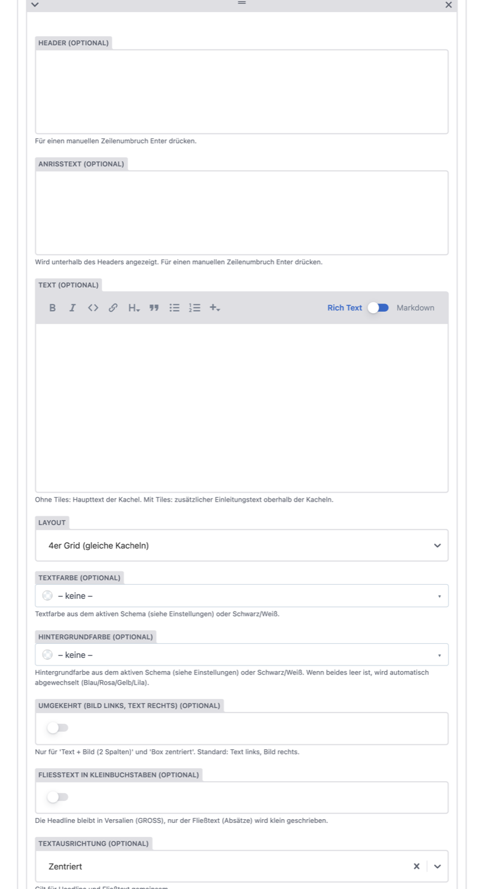

| Feld | Hinweis |
|---|---|
| Header | Überschrift des Blocks. Für einen manuellen Zeilenumbruch Enter drücken. |
| Anrisstext | Kurztext direkt unter dem Header |
| Text | Fließtext (Markdown-Editor). **Ohne Kacheln:** der Haupttext des Blocks. **Mit Kacheln:** zusätzlicher Einleitungstext oberhalb der Kacheln. |
| Layout | "4er Grid", "4er Grid (gleiche Kacheln)", "Text + Bild (2 Spalten)" oder "Box zentriert" |
| Textfarbe / Hintergrundfarbe | Aus dem aktiven Farbschema (Kapitel 4.11) oder Schwarz/Weiß. Sind beide leer, wechselt die Website automatisch durch (Blau/Rosa/Gelb/Lila). |
| Umgekehrt (Bild links, Text rechts) | Nur für "Text + Bild (2 Spalten)" und "Box zentriert". Standard: Text links, Bild rechts. |
| Textausrichtung | Linksbündig (Standard) oder Zentriert — gilt für Headline und Fließtext gemeinsam |
| Images | Bilderliste für Bild-Layouts |
| Tiles (Kacheln) | Bis zu 4 Kacheln, siehe unten |

**Die Layouts:**

- **4er Grid** — bis zu 4 Kacheln nebeneinander, unterschiedlich hoch.
- **4er Grid (gleiche Kacheln)** — wie oben, aber alle Kacheln sind gleich groß; gedacht für kurze Zahlen/Fakten nebeneinander.
- **Text + Bild (2 Spalten)** — zweispaltig, Text und Bild nebeneinander.
- **Box zentriert** — zentrierte Box; hier werden nur die **ersten 2 Kacheln** angezeigt.

**Kacheln (Tiles):** Pro Kachel entweder **Text oder Bilder** ausfüllen — nicht beides. Je Kachel gibt es außerdem: **Kategorie** (verlinkt die Kachel auf die Kategorie-Seite), **Manueller Link** (wird statt der Kategorie verwendet), **Textfarbe/Hintergrundfarbe** (nur für Text-Kacheln) und **Icons** (nur für Text-Kacheln, jeweils SVG + Text + Link, werden unter dem Text angezeigt). Enthält eine Kachel mehrere Bilder, wird sie automatisch als Slider mit Pfeilen dargestellt.

**Teaser (nur Shops-/Gastronomie-Übersicht):**

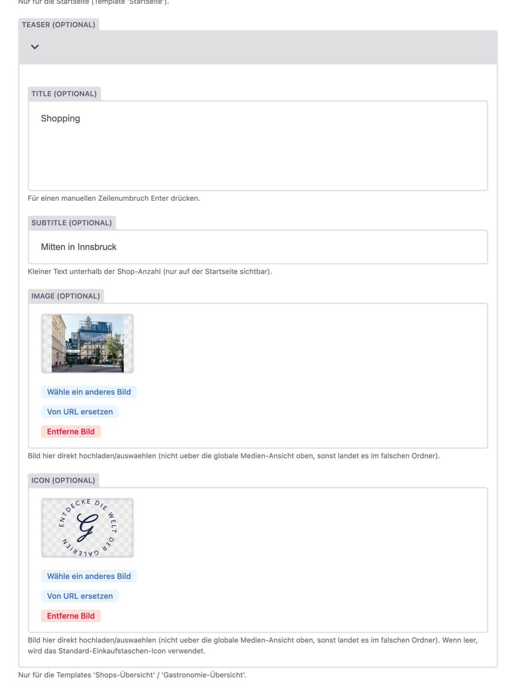

| Feld | Hinweis |
|---|---|
| Title | Titel des Teasers. Für einen manuellen Zeilenumbruch Enter drücken. |
| Subtitle | Kleiner Text unterhalb der Shop-Anzahl — **nur auf der Startseite sichtbar** |
| Image | Teaser-Bild |
| Icon | **Muss eine SVG-Datei sein.** Leer lassen, um das Standard-Einkaufstaschen-Icon zu verwenden. |

### 4.2 Funnels

Eigenständige Landingpages außerhalb der normalen Seitenstruktur, z. B. für Kampagnen mit eigener Ziel-URL.

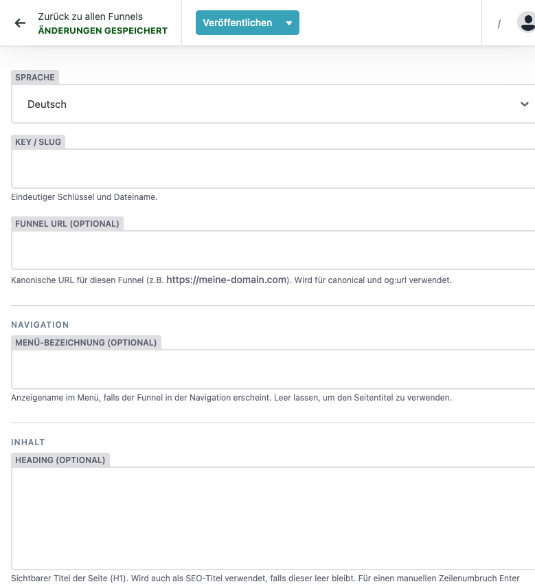

Funktioniert wie eine Page (gleiche Blocks/Teaser/Photos-Bausteine, siehe 4.1), mit diesen Unterschieden:

- **Keine Template-Auswahl** — Funnels haben immer ihr eigenes Layout.
- **Kein Menü- und kein Reihenfolge-Feld** — ein Funnel steht bewusst außerhalb der Navigation (nur **Menü-Bezeichnung** ist vorhanden).
- **Keine SEO-URL** — die Adresse ergibt sich direkt aus dem Key/Slug und liegt auf oberster Ebene (`/mein-funnel` bzw. `/en/mein-funnel`).

| Feld | Pflicht | Hinweis |
|---|---|---|
| Funnel URL | nein | Kanonische Adresse dieses Funnels, wird für `canonical` und `og:url` verwendet |

### 4.3 Categories (Kategorien)

Kategorien, mit denen Locations und Kacheln verschlagwortet werden (z. B. "Schmuck", "Geschenkideen").

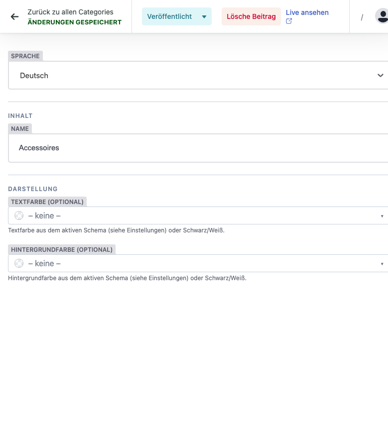

| Feld | Pflicht | Hinweis |
|---|---|---|
| Sprache | ja | Kategorien existieren pro Sprache separat |
| Name | ja | Anzeigename der Kategorie |
| Textfarbe / Hintergrundfarbe | nein | Aus dem aktiven Farbschema (Kapitel 4.11) oder Schwarz/Weiß |

### 4.4 Services

Die Center-Services (z. B. Apotheken, Bürgerservice, Ladestationen). Die Services-Seite hat zwei Bereiche: **oben die Kacheln** (nur Services mit "Als Kachel anzeigen") und darunter die Liste **"Services von A bis Z"**, in der **immer alle** Services stehen.

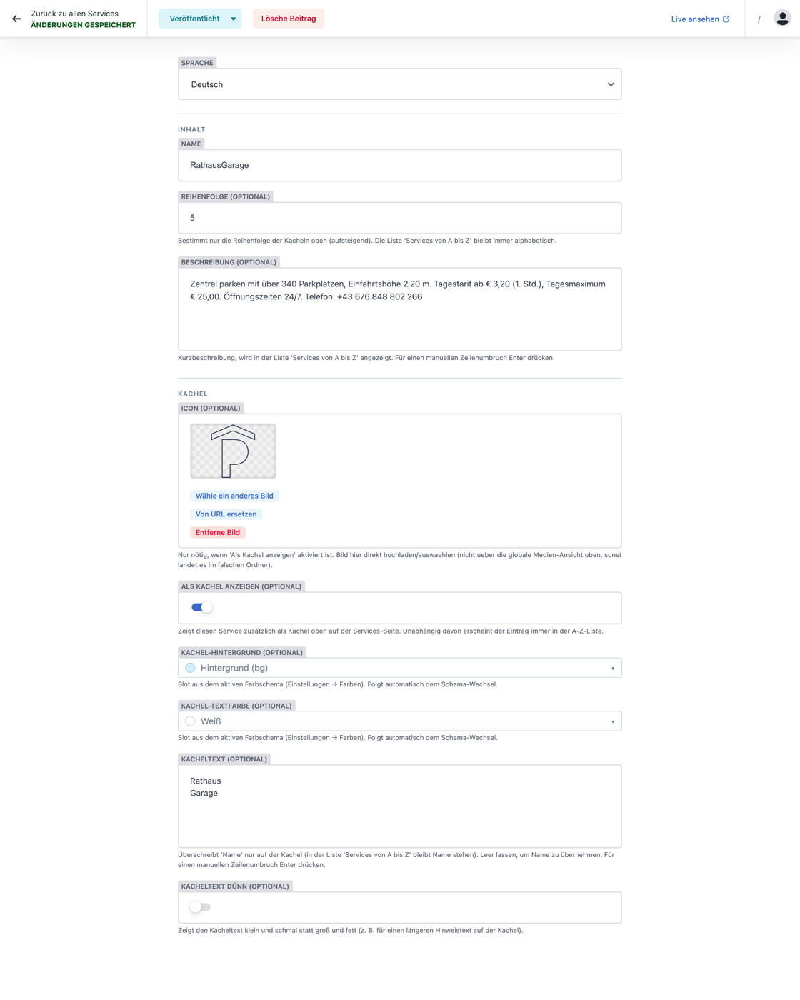

| Feld | Pflicht | Hinweis |
|---|---|---|
| Sprache | ja | Deutsch/Englisch |
| Name | ja | Erscheint in der A-Z-Liste |
| Reihenfolge | nein | Zahl (Standard 999). Bestimmt **nur** die Reihenfolge der Kacheln oben (aufsteigend). Die A-Z-Liste bleibt immer alphabetisch. |
| Beschreibung | nein | Kurztext für die A-Z-Liste |
| Icon | nein | Nur nötig, wenn "Als Kachel anzeigen" aktiv ist. **Muss eine SVG-Datei sein.** |
| Als Kachel anzeigen | nein | Zeigt den Service zusätzlich als Kachel oben auf der Services-Seite |
| Kachel-Hintergrund / -Textfarbe | nein | Nur relevant, wenn als Kachel angezeigt. Aus dem aktiven Farbschema (Kapitel 4.11). |
| Kacheltext | nein | Überschreibt den **Namen nur auf der Kachel** — in der A-Z-Liste bleibt der Name stehen. Leer lassen, um den Namen zu übernehmen. |
| Kacheltext dünn | nein | Zeigt den Kacheltext klein und schmal statt groß und fett (z. B. für einen längeren Hinweistext auf der Kachel) |

> ℹ️ In der Listenansicht lässt sich über **Sortieren nach** zwischen Reihenfolge, Name und Sprache wechseln.

### 4.5 FAQs

Fragen & Antworten für die FAQ-Seite.

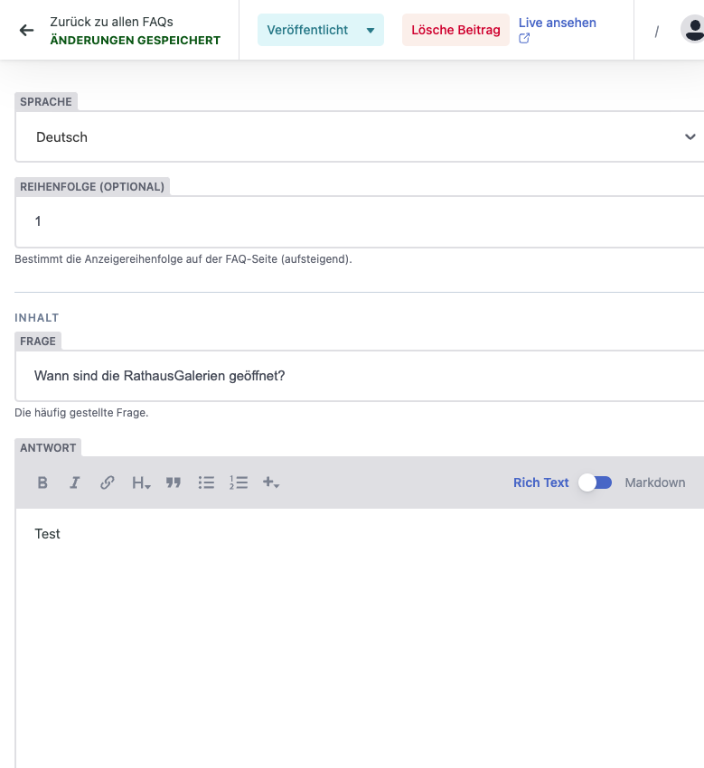

| Feld | Pflicht | Hinweis |
|---|---|---|
| Reihenfolge | nein | Zahl; bestimmt die Anzeigereihenfolge (aufsteigend) |
| Frage | ja | Die Frage im Klartext |
| Antwort | ja | Markdown-Editor mit Formatierungsleiste |

### 4.6 Locations (Shops & Gastronomie)

Alle Shops und Gastronomiebetriebe des Centers.

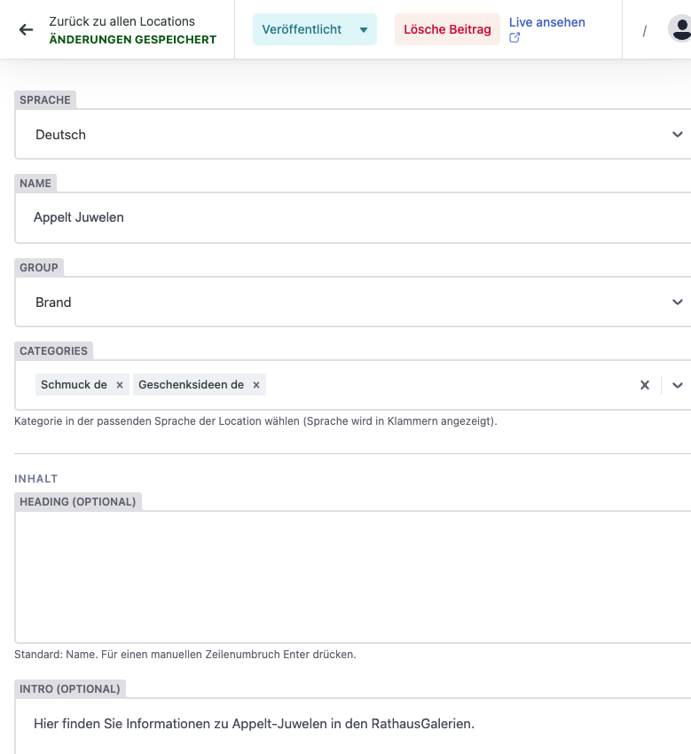

| Feld | Pflicht | Hinweis |
|---|---|---|
| Name | ja | Name des Shops/Lokals |
| Group | ja | "Brand" (Shop) oder "Culinary" (Gastronomie) — steuert, auf welcher Übersichtsseite die Location erscheint |
| Categories | nein | Mehrfachauswahl aus den Kategorien der **gleichen Sprache** (Sprache steht in Klammern hinter jeder Kategorie) |
| Heading | nein | Standard: Name |
| Intro | nein | Einleitungstext |
| A-Z Heading / A-Z Intro | nein | Nur sichtbar auf Seiten mit Template "Services-Übersicht" |
| Content | ja | Fließtext (Markdown) |
| Hours | nein | Liste von Zeile-Paaren (z. B. "Mo–Fr" / "9:00–19:00") |
| Address | ja | Adresse, Markdown-Editor |
| Contact → Phone/Email/Website | teils | Email muss ein gültiges E-Mail-Format haben; Website muss mit `http://` oder `https://` beginnen |
| Logo | ja | Bild direkt im Feld hochladen (siehe Kapitel 5!) |
| Images | nein | Bildergalerie |
| View ID | nein | Technische ID für den Lageplan, Format `shop-…` — nur ändern, wenn dir bekannt ist, wozu sie dient |
| Textfarbe / Hintergrundfarbe | nein | Aus dem aktiven Farbschema |
| SEO | teils | Wie bei Pages |

### 4.7 Jobs (Stellenanzeigen)

Offene Stellen, die auf der Jobs-Seite gelistet werden.

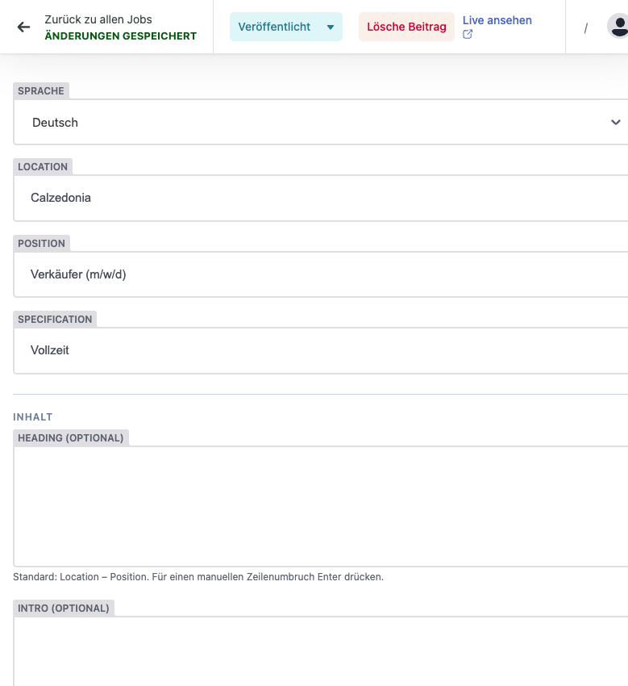

| Feld | Pflicht | Hinweis |
|---|---|---|
| Location | ja | Name des Shops/Unternehmens |
| Position | ja | Jobtitel |
| Specification | ja | Zusatzinfo (z. B. "Vollzeit") |
| Heading | nein | Standard: "Location – Position" |
| Intro | nein | Standard: Specification |
| Content | ja | Stellenbeschreibung (Markdown) |
| Images | nein | Bildergalerie |
| Textfarbe / Hintergrundfarbe | nein | Aus dem aktiven Farbschema |
| SEO | teils | Wie bei Pages |

> ℹ️ Der interne Dateiname (Slug) wird automatisch aus Location, Position und dem Erstellungsdatum gebildet — darum musst du dich nicht kümmern.

### 4.8 News

News-Beiträge/Meldungen.

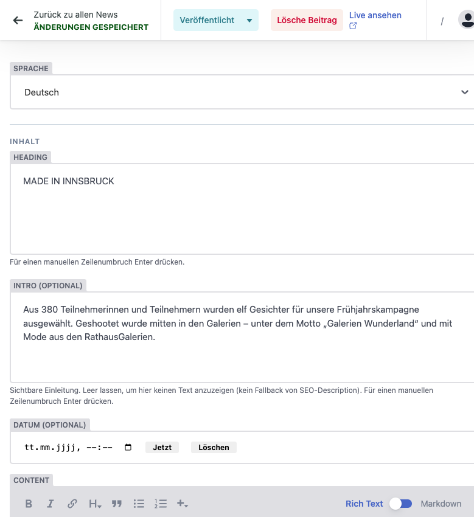

| Feld | Pflicht | Hinweis |
|---|---|---|
| Heading | ja | Titel der Meldung |
| Intro | nein | Einleitungstext |
| Datum | nein | Datum/Uhrzeit der Meldung |
| Content | ja | Fließtext (Markdown) |
| Images | nein | **Reihenfolge ist wichtig:** 1. Bild = großer Teaser oben, 2. Bild = Foto neben dem Text, alle weiteren = Galerie |
| Textfarbe / Hintergrundfarbe | nein | Aus dem aktiven Farbschema |
| SEO | teils | Wie bei Pages |

### 4.9 Gewinnspiele

Aktionsseiten mit optionalem Teilnahme-Formular. In der Seitenleiste heißt dieser Inhaltstyp **Gewinnspiel** (Einzahl).

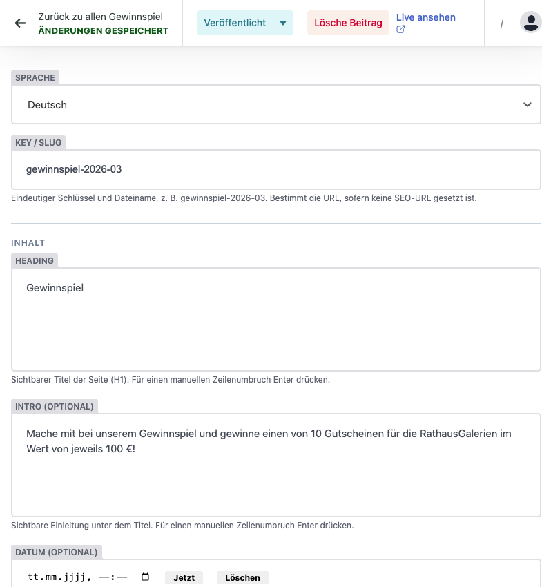

| Feld | Pflicht | Hinweis |
|---|---|---|
| Key / Slug | ja | Nur Kleinbuchstaben, Zahlen, `-`, z. B. `gewinnspiel-2026-03`. Bestimmt die URL, außer eine SEO-URL ist gesetzt. |
| Heading | ja | Titel |
| Intro | nein | Einleitungstext |
| Datum | nein | Optional, z. B. Start/Ende der Aktion; erscheint über dem Titel |
| Content | nein | Fließtext (Markdown) |
| Images | nein | 1. Bild = großes Hero-Bild oben |
| Textfarbe / Hintergrundfarbe | nein | Aus dem aktiven Farbschema |
| Formular | nein | Siehe unten — **ohne Formularnamen erscheint kein Teilnahmeformular auf der Seite** |
| SEO | teils | Wie bei Pages |

**Formular im Detail:**

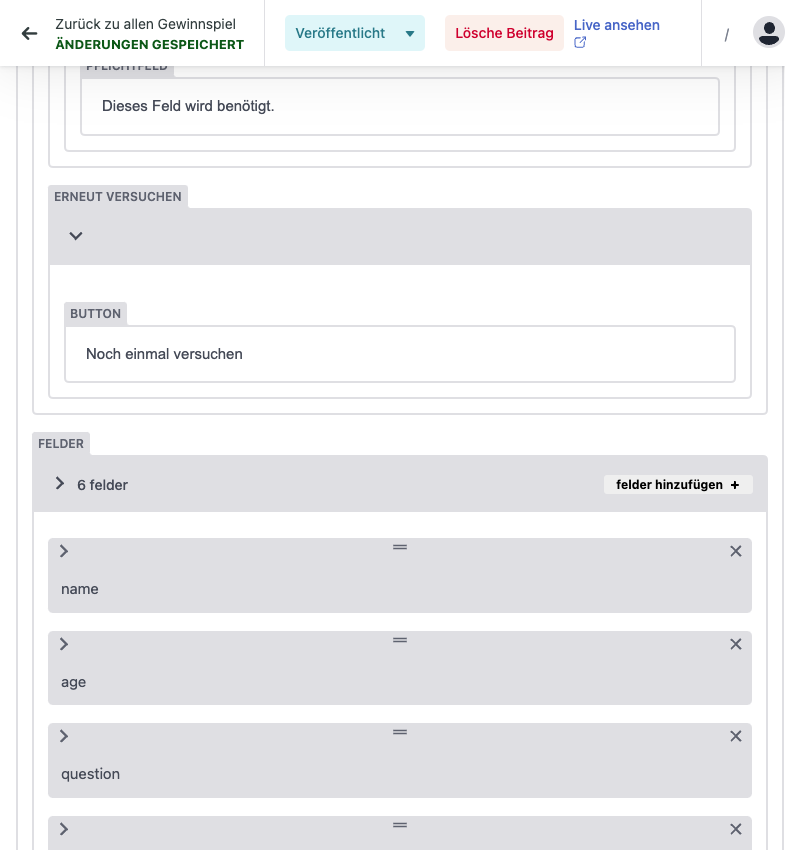

- **Formularname (Netlify):** eindeutiger technischer Name pro Kampagne (z. B. `Lotterie-2026`). **Bei jeder neuen Kampagne unbedingt ändern** — Einsendungen erscheinen unter diesem Namen im Netlify-Dashboard; ein wiederverwendeter Name vermischt alte und neue Anmeldungen. Frag deinen Ansprechpartner, falls du im Netlify-Dashboard keinen Zugriff hast.
- **Zustände:** Button-Beschriftungen für "Ausgangszustand", "Wird gesendet" und "Erneut versuchen" sowie Titel/Text für "Erfolg" und "Fehler" (inkl. der Fehlermeldung für fehlende Pflichtfelder). Alle Texte haben sinnvolle Standardwerte und müssen nicht zwingend angepasst werden.
- **Felder:** Liste der Formularfelder in Anzeigereihenfolge. Pro Feld: technischer Name (nur `a-z`, `0-9`, `-`, `_` — wird 1:1 an Netlify Forms übergeben), Label (die sichtbare Beschriftung), Typ (Text, E-Mail, Zahl, Datum, Auswahl, Checkbox, mehrzeiliger Text), ob Pflichtfeld, und bei Typ "Auswahl" die auswählbaren Optionen (Label + Wert je Option).

> ℹ️ Welches Gewinnspiel gerade als das laufende markiert ist und welcher Link im Teilnahmebedingungen-Hinweis steht, wird unter **Einstellungen → Gewinnspiel** gepflegt (Kapitel 4.12).

### 4.10 Blocks

Wiederverwendbare, globale Website-Bausteine: **General**, **Header**, **Footer**, **Location** (Beschriftung für Öffnungszeiten). Es gibt jeweils **einen Eintrag pro Sprache und Baustein-Typ** — neue Blocks sollten nur in Absprache mit dem technischen Ansprechpartner angelegt werden, da sie fest im Seitenlayout verankert sind.

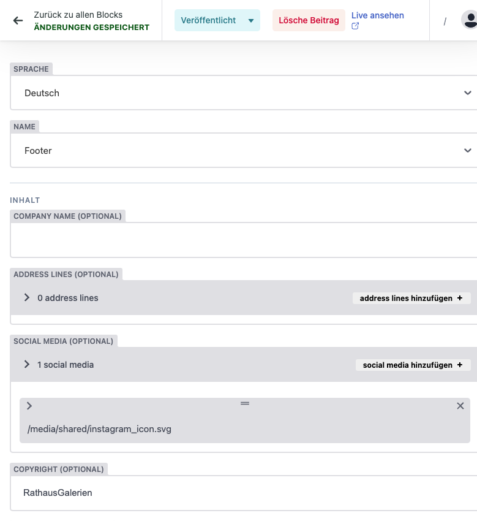

| Feld | Pflicht | Hinweis |
|---|---|---|
| Name | ja | Welcher Baustein: General/Header/Footer/Location |
| Company Name | nein | Firmenname, z. B. im Footer |
| Address Lines | nein | Liste einzelner Adresszeilen |
| Social Media | nein | Liste aus Icon (**muss SVG sein**) + Link (interner Pfad mit `/` oder vollständige `http(s)://`-URL) |
| Copyright | nein | Copyright-Zeile |
| Label Hours | nein | Beschriftung für Öffnungszeiten |

### 4.11 Farbschemas

Wiederverwendbare Farbpaletten. Ein Schema wird über die **Einstellungen** (4.12) für die gesamte Website aktiviert; alle "Textfarbe"/"Hintergrundfarbe"-Auswahlfelder in anderen Inhaltstypen greifen automatisch auf die 8 Farben des aktiven Schemas zu.

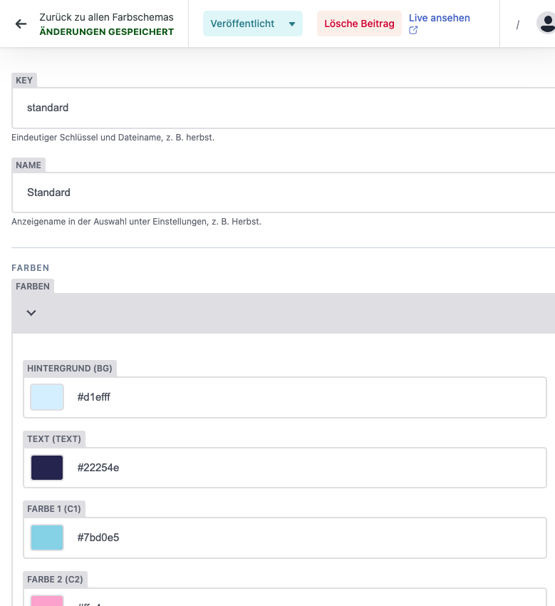

| Feld | Pflicht | Hinweis |
|---|---|---|
| Key | ja | Technischer, eindeutiger Name, z. B. `herbst` |
| Name | ja | Anzeigename in der Auswahl, z. B. "Herbst" |
| Farben | ja | 8 Farbwerte: Hintergrund (bg), Text, sowie Farbe 1–6 (c1–c6) |

> ⚠️ Änderungen an einem **bereits aktiven** Farbschema wirken sich sofort auf die gesamte Website aus. Neue Schemas lieber unter neuem Key anlegen und erst nach Kontrolle über die Einstellungen aktivieren.

### 4.12 Einstellungen

Globale Einstellungen der Website. Hier gibt es keinen "Neuer Eintrag"-Button — es sind zwei feste Einträge: **Farben** und **Gewinnspiel**.

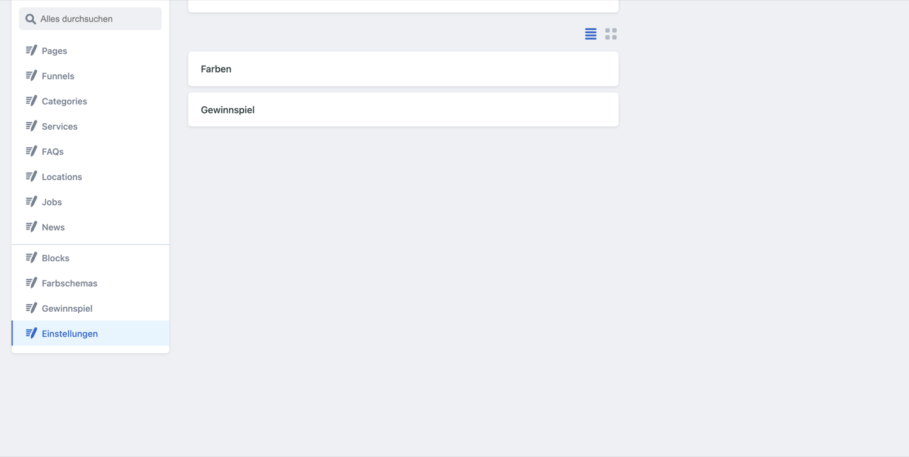

**Farben:**

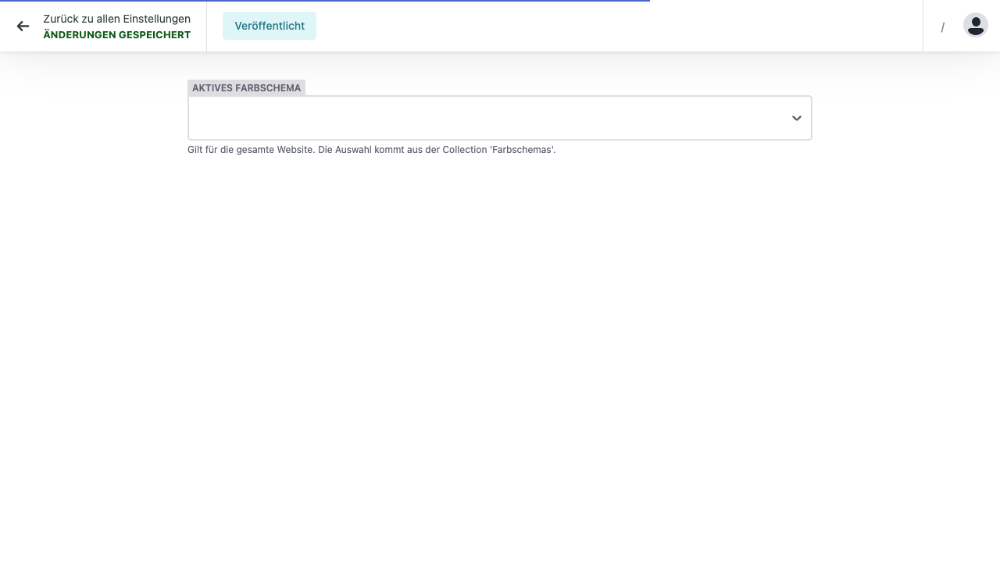

| Feld | Pflicht | Hinweis |
|---|---|---|
| Aktives Farbschema | ja | Wählt eines der unter 4.11 angelegten Farbschemas für die gesamte Website aus |

**Gewinnspiel:**

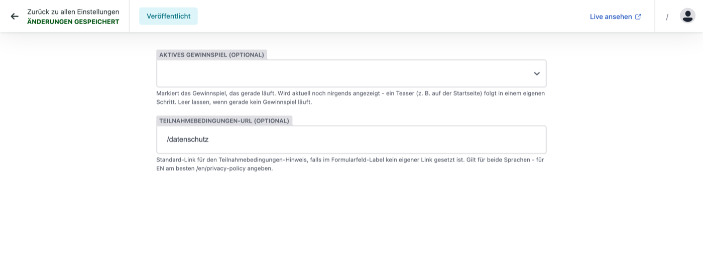

| Feld | Pflicht | Hinweis |
|---|---|---|
| Aktives Gewinnspiel | nein | Markiert das Gewinnspiel (Kapitel 4.9), das gerade läuft. Leer lassen, wenn gerade keines läuft. |
| Teilnahmebedingungen-URL | nein | Standard-Link für den Teilnahmebedingungen-Hinweis im Formular, falls im Feld-Label kein eigener Link gesetzt ist. Standard: `/datenschutz`; gilt für beide Sprachen — für Englisch am besten `/en/privacy-policy` angeben. |

> ℹ️ Das **aktive Gewinnspiel** wird derzeit noch nirgends auf der Website angezeigt — ein Teaser (z. B. auf der Startseite) ist als eigener Schritt geplant. Die Auswahl schadet nicht, bewirkt aktuell aber noch nichts Sichtbares.

---

## 5. Bilder & Medien

Es gibt zwei verschiedene Wege, ein Bild ins CMS zu bekommen — das ist die **häufigste Fehlerquelle**, deshalb genau lesen:

> ⚠️ **Wichtig:** Jedes Bildfeld in einem Formular hat einen **eigenen**, zum jeweiligen Inhaltstyp passenden Speicherordner. Lade Bilder **immer direkt über das jeweilige Bildfeld** hoch (Button "Wähle ein anderes Bild" direkt am Feld). Nutze **nicht** den allgemeinen Reiter **Medien** oben links, um ein Bild für ein bestimmtes Feld auszuwählen oder hochzuladen — darüber hochgeladene Bilder landen in einem anderen, allgemeinen Ordner und können zu falsch einsortierten oder doppelten Bildern führen.

**Globale Medien-Bibliothek** (Reiter "Medien" oben links) — zeigt alle bisher hochgeladenen Bilder projektweit, z. B. zum Nachschauen, was es schon gibt:

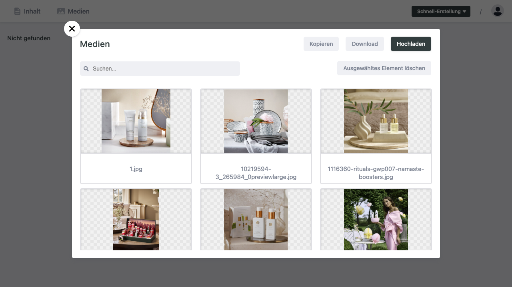

**Feldeigener Bild-Upload** (richtige Methode) — Klick auf "Wähle ein anderes Bild" direkt an einem Bildfeld öffnet einen Dialog, der **nur** die zu diesem Inhaltstyp gehörenden Bilder zeigt (hier z. B. das Logo-Feld einer Location — man sieht: völlig andere Bilder als in der globalen Bibliothek oben):

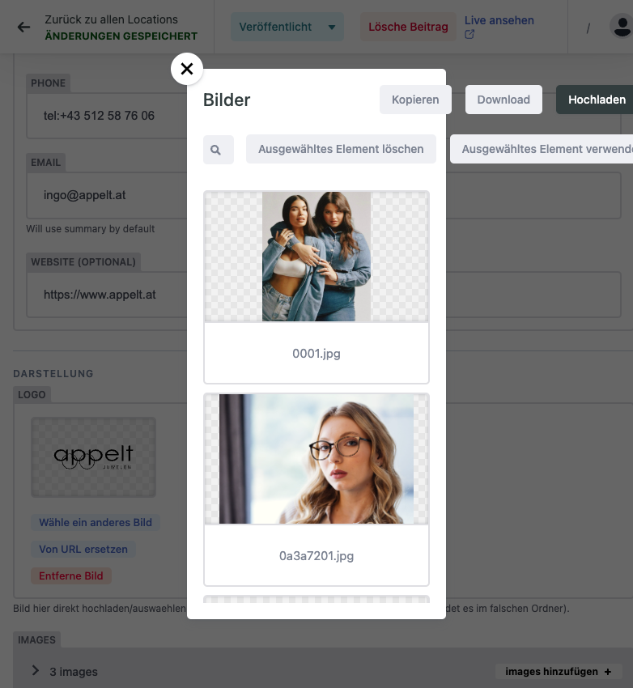

**So lädst du ein Bild korrekt hoch:**

1. Öffne den gewünschten Eintrag und scrolle zum Bildfeld.
2. Klicke direkt am Feld auf **Wähle ein anderes Bild** (oder bei leerem Feld: **Bild hochladen**).
3. Wähle im sich öffnenden Dialog **Hochladen**, um eine neue Datei von deinem Computer hochzuladen, oder wähle ein bereits vorhandenes Bild aus der Liste.
4. Bestätige mit **Ausgewähltes Element verwenden**.

**Empfohlene Formate & Größen:**
- Format: JPG für Fotos, SVG für Icons (bei Icon-Feldern ist SVG oft zwingend vorgeschrieben — das CMS weist mit einer Fehlermeldung darauf hin, falls das falsche Format gewählt wird).
- Größe: Bilder vor dem Hochladen sinnvoll verkleinern (nicht direkt unbearbeitete Kamera-/Handyfotos mit mehreren MB hochladen) — grober Richtwert für große Teaser-/Hero-Bilder: max. ca. 2000 Pixel Breite; für kleinere Bilder in Kacheln/Listen reichen oft 800–1000 Pixel Breite.
- Dateigröße möglichst unter 500 KB pro Bild halten, damit die Website schnell lädt.

**Alt-Texte:** Manche Bildlisten (z. B. Tiles-Bilder) haben ein eigenes **Alt-Text**-Feld. Trage hier kurz und sachlich ein, was auf dem Bild zu sehen ist — das hilft Menschen, die das Bild nicht sehen können (Screenreader), und der Auffindbarkeit in Suchmaschinen.

---

## 6. Speichern & Veröffentlichen

Es gibt in diesem Projekt **keinen Entwurfs-Modus** und **keinen redaktionellen Freigabe-Workflow**: Jeder Klick auf den Speichern-Button überträgt deine Änderung direkt.

- Solange ein Formular **unveränderte** Daten zeigt, steht oben links **"ÄNDERUNGEN GESPEICHERT"** (grün) und der Button daneben ist inaktiv/ausgegraut.
- Sobald du etwas änderst, wechselt die Anzeige zu **"UNGESPEICHERTE ÄNDERUNGEN"** (rot) und der Button (**Veröffentlichen**) wird aktiv:

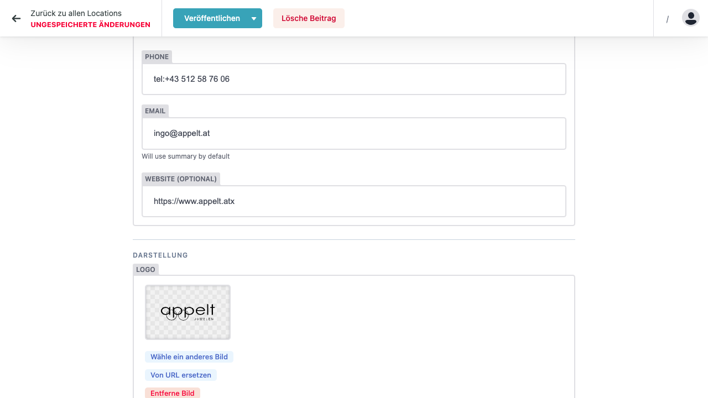

**So speicherst und veröffentlichst du:**

1. Nimm deine Änderungen im Formular vor.
2. Klicke oben auf den aktiv gewordenen Button (**Veröffentlichen**).
3. Die Anzeige wechselt zurück zu "ÄNDERUNGEN GESPEICHERT" — deine Änderung ist jetzt gespeichert und reiht sich in die Warteschlange für die nächste Veröffentlichung ein (Kapitel 7).

> ⚠️ Es gibt **keinen "Rückgängig"-Button** nach dem Speichern. Wenn du eine Änderung testen willst, notiere dir vorher den ursprünglichen Text, damit du ihn bei Bedarf wiederherstellen kannst.

---

## 7. Wie lange dauert es, bis Änderungen live sind?

Nach dem Speichern passiert im Hintergrund Folgendes:

1. Deine Änderung wird in die zentrale Datenablage der Website übernommen.
2. Das löst automatisch einen **Build** aus — die Website-Software (Gatsby) baut daraus die komplette, fertige Website neu.
3. Die neu gebaute Website wird automatisch veröffentlicht.

**Faustregel:** Das dauert in der Regel **einige Minuten** (grobe Schätzung, kein exakter Wert — abhängig davon, wie viele Seiten die Website insgesamt hat und wie ausgelastet der Build-Dienst gerade ist). Es ist normal, dass eine Änderung nicht sofort sichtbar ist.

**Woran erkennst du, ob der Build schon fertig ist?**
- Ruf die betroffene Seite im Browser auf und lade sie mit `Strg+F5` (bzw. `Cmd+Shift+R` auf dem Mac) neu, um sicherzugehen, dass du keine ältere, zwischengespeicherte Version siehst.
- Wenn deine Änderung nach 10–15 Minuten immer noch nicht sichtbar ist, wende dich an deinen Ansprechpartner (Kapitel 10) — möglicherweise ist beim Build ein Fehler aufgetreten.

---

## 8. Häufige Fehler & Problembehebung

**Der Speichern-Button ist ausgegraut / lässt sich nicht klicken.**
→ Das ist normal, solange du noch keine Änderung vorgenommen hast (Zustand "ÄNDERUNGEN GESPEICHERT"). Nimm zuerst eine Änderung in einem Feld vor.

**Ein Bild wird auf der Website nicht angezeigt.**
→ Meist wurde das Bild über die globale Medien-Bibliothek statt direkt am Feld hochgeladen (siehe Kapitel 5, Upload-Falle). Lade das Bild erneut direkt über das betroffene Feld hoch.
→ Prüfe außerdem, ob seit dem Speichern genug Zeit für einen Build vergangen ist (Kapitel 7).

**Beim Icon-/SVG-Feld erscheint eine Fehlermeldung.**
→ Dieses Feld akzeptiert ausschließlich `.svg`-Dateien. Wandle das Bild vorher in eine SVG-Datei um oder wende dich an deinen Ansprechpartner.

**Login funktioniert nicht (falsches Passwort / keine E-Mail erhalten).**
→ Nutze "Forgot password?" im Login-Fenster (Kapitel 2). Kommt keine E-Mail an: Spam-Ordner prüfen, danach den Ansprechpartner kontaktieren — evtl. ist noch kein Zugang für deine E-Mail-Adresse angelegt.

**Meine Änderung ist seit über 15 Minuten nicht live.**
→ Prüfe, ob du wirklich auf "Veröffentlichen" geklickt hast (Status sollte "ÄNDERUNGEN GESPEICHERT" zeigen). Ist das der Fall, wende dich an deinen Ansprechpartner — es könnte ein Fehler beim automatischen Website-Build vorliegen.

**Ein Pflichtfeld lässt sich nicht speichern / zeigt eine rote Fehlermeldung.**
→ Prüfe das erwartete Format (z. B. Key/Slug nur Kleinbuchstaben/Zahlen/Bindestrich, E-Mail muss ein gültiges Format haben, Website-Links müssen mit `http://` oder `https://` beginnen). Die Feldreferenzen in Kapitel 4 listen die wichtigsten Formatregeln.

**Ich habe versehentlich etwas gelöscht oder überschrieben.**
→ Sofort den Ansprechpartner (Kapitel 10) kontaktieren — je nachdem lässt sich eine ältere Version über die technische Versionsverwaltung wiederherstellen, aber das kannst du nicht selbst im CMS rückgängig machen.

---

## 9. Glossar

| Begriff | Bedeutung |
|---|---|
| **CMS** | Content-Management-System — die Oberfläche, in der du hier Inhalte bearbeitest. |
| **Collection** | Englischer Fachbegriff für einen Inhaltstyp (z. B. "Pages", "News") in der linken Seitenleiste. |
| **Feld/Widget** | Ein einzelnes Eingabeelement in einem Formular (Textfeld, Bildfeld, Auswahlliste, …). |
| **Slug/Key** | Der technische, URL-taugliche Name eines Eintrags (nur Kleinbuchstaben, Zahlen, Bindestriche). |
| **Markdown** | Eine einfache Text-Formatierung (z. B. `**fett**`, `- Aufzählung`). Der Editor mit Formatierungsleiste erzeugt sie automatisch — du musst die Syntax nicht selbst tippen. |
| **SEO** | Suchmaschinenoptimierung — Felder, die steuern, wie eine Seite bei Google & Co. sowie beim Teilen in sozialen Medien angezeigt wird. |
| **Build** | Der automatische Vorgang, bei dem aus den gespeicherten Inhalten die fertige Website neu erzeugt wird (siehe Kapitel 7). |
| **Deploy/Veröffentlichung** | Das Online-Stellen einer neu gebauten Website-Version. |
| **Netlify Identity** | Der Login-Dienst, über den sich Redakteure am CMS anmelden (Kapitel 2). |
| **Repository ("Repo")** | Die zentrale, versionierte Datenablage, in der alle Inhalte und der Programmcode der Website gespeichert sind. Für Redakteure nicht direkt zugänglich — das CMS ist die vorgesehene Oberfläche dafür. |

---

## 10. Support & Ansprechpartner

Bei Fragen, Problemen oder wenn du einen neuen Zugang benötigst, wende dich an:

**[Name/Team einfügen]**
**E-Mail:** [E-Mail-Adresse einfügen]
**Telefon:** [Telefonnummer einfügen, optional]

> ℹ️ Trag hier die für euch zuständige Person oder Agentur ein.
